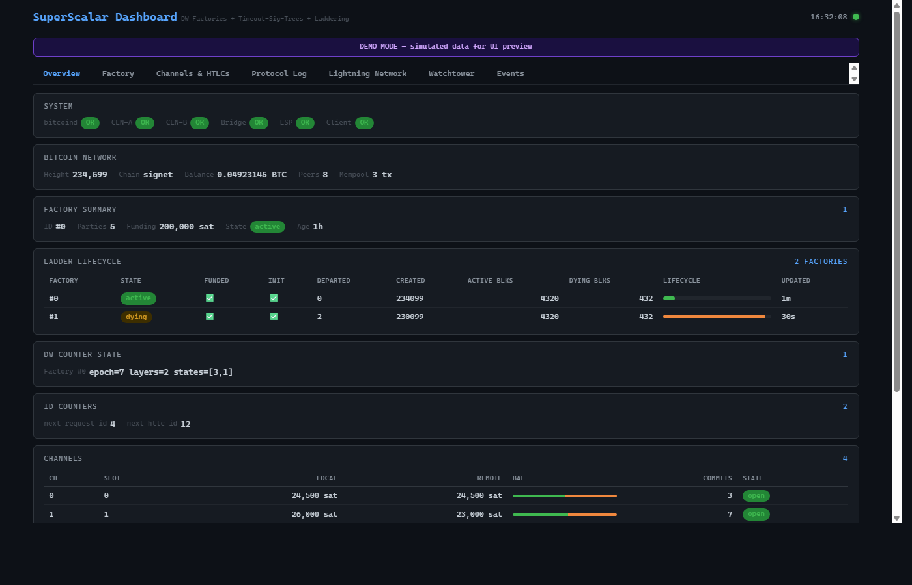

# SuperScalar

[](https://github.com/8144225309/SuperScalar/actions)
[](https://github.com/8144225309/SuperScalar/releases)
[](LICENSE)
[](https://delvingbitcoin.org/t/superscalar-laddered-timeout-tree-structured-decker-wattenhofer-factories/1143)
[](CONTRIBUTING.md)

> v0.1.12 — 30/30 signet exhibition tests passed (S1–S30). Standalone watchtower penalty signing, secp256k1-zkp pin sync with CLN/wally, rotation conservation fix. 1363 unit tests, 42 regtest integration tests.

> ⚠️ **Production readiness — multi-process LSPs**: real-deployment LSPs (with clients running as separate processes) currently lack the wire-ceremony poison TX defense.  The watchtower can detect breaches and broadcast the latest signed state TX, but cannot redistribute L-stock / sales-stock to clients on cheating — that defense was implemented as a single-process primitive (PR #121) and the multi-process MuSig2 ceremony equivalent is not yet wired.  See [`docs/poison-tx.md`](docs/poison-tx.md) "SECURITY-CRITICAL: multi-process production gap" for details.  Single-process / signet self-tests / `--demo` deployments have full poison TX protection and are unaffected.  Mainnet multi-process LSPs should wait for the wire-ceremony poison TX to land.

Implementation of [ZmnSCPxj's SuperScalar design](https://delvingbitcoin.org/t/superscalar-laddered-timeout-tree-structured-decker-wattenhofer-factories/1143) — laddered timeout-tree-structured Decker-Wattenhofer channel factories for Bitcoin.

A Bitcoin channel factory protocol combining:

- **Decker-Wattenhofer invalidation** — alternating kickoff/state layers with decrementing nSequence
- **Timeout-sig-trees** — N-of-N MuSig2 key-path with CLTV timeout script-path fallback
- **Poon-Dryja channels** — standard Lightning channels at leaf outputs with HTLCs
- **LSP + N clients** — the LSP participates in every branch; no consensus changes required

## Features

| Area | What's Implemented |
|------|--------------------|
| **Cryptography** | MuSig2 (key agg, 2-round signing, nonce pools), Schnorr adaptor signatures, PTLC key turnover, shachain revocation, 2-leaf taptree with script-path revocation penalty |
| **Transport** | BOLT #8 Noise_XK encrypted transport (ChaCha20-Poly1305, key rotation, phase timeouts), BOLT #7 gossip (node_announcement, channel_announcement, channel_update, gossip queries), Tor hidden services + SOCKS5 |
| **Persistence** | SQLite3 with 27 tables — factory state, channels, HTLCs, watchtower data; full crash recovery |
| **Wire Protocol** | Full BOLT #2 commitment (update_add/fulfill/fail HTLC, commitment_signed, revoke_and_ack, update_fee), BOLT #4 multi-hop onion (Sphinx, keysend TLV), BOLT #11 invoice, BOLT #12 offers + blinded paths, LSPS0/1/2, MPP (10-part / 32-payment), AMP, Dijkstra pathfinding over gossip graph, PTLC state machine, dual-fund v2, cooperative close, factory lifecycle, reconnection |
| **Signing** | Distributed MuSig2 signing for factory creation (2-round N-of-N ceremony) and per-leaf advance (single-round 2-of-2) |
| **Security** | Client + LSP + standalone watchtowers, breach detection + penalty broadcast (key-path and script-path) + L-stock burn, per-client close addresses, encrypted keyfiles (PBKDF2 600K iterations), encrypted backup/restore (PBKDF2 + ChaCha20-Poly1305), BIP39 mnemonic seed recovery, per-IP connection rate limiting, shell-free subprocess execution |
| **Operations** | Web dashboard, JSON diagnostic reports, interactive CLI, configurable economics (fee splits, placement modes), UTXO coin selection, RBF fee bumping |
| **Testing** | 1363 unit + 42 regtest integration + 30 signet exhibition tests (S1–S30), CI on every push (Linux, macOS, ARM64, sanitizers, cppcheck, coverage, fuzz) |

## Quick Start

From a fresh Ubuntu machine to a running demo in 5 commands:

```bash
sudo apt install build-essential cmake libsqlite3-dev python3  # dependencies
git clone https://github.com/8144225309/SuperScalar.git && cd SuperScalar
mkdir -p build && cd build && cmake .. && make -j$(nproc) && cd ..
source tools/setup_regtest.sh                                   # starts bitcoind, funds wallet
bash tools/run_demo.sh --basic                                  # factory + payments + close (~30s)
```

Creates a 5-of-5 factory, opens 4 channels, runs payments, and cooperative-closes. If `bitcoind` is already running, `run_demo.sh` detects it.

## Build

**System prerequisites**: a C compiler (gcc/clang), CMake 3.14+, SQLite3 dev headers, Python 3 (for tooling)

```bash
# Ubuntu / Debian
sudo apt install build-essential cmake libsqlite3-dev python3

# macOS (SQLite3 ships with Xcode; install CMake via Homebrew if needed)
brew install cmake
```

```bash
mkdir -p build && cd build
cmake .. && make -j$(nproc 2>/dev/null || sysctl -n hw.logicalcpu 2>/dev/null || echo 4)
```

**Auto-fetched** (CMake FetchContent):
- [secp256k1-zkp](https://github.com/BlockstreamResearch/secp256k1-zkp) — MuSig2, Schnorr, adaptor signatures
- [cJSON](https://github.com/DaveGamble/cJSON) — JSON parsing

**Optional build flags:**

```bash
cmake .. -DENABLE_SANITIZERS=ON   # AddressSanitizer + UBSan (debug builds)
cmake .. -DENABLE_COVERAGE=ON     # gcov instrumentation for lcov reports
CC=clang cmake .. -DENABLE_FUZZING=ON  # libFuzzer targets (requires clang)
```

## Tests

1363 automated tests (unit + regtest integration) plus 30 signet exhibition tests (S1–S30). CI runs automated suites on every push — Linux, macOS, ARM64, AddressSanitizer, cppcheck static analysis, coverage, and libFuzzer.

See [docs/testing-guide.md](docs/testing-guide.md) for the full testing guide.

```bash
cd build

# Unit tests only (no bitcoind needed)
./test_superscalar --unit

# Integration tests (needs bitcoind -regtest)
bitcoind -regtest -daemon -rpcuser=rpcuser -rpcpassword=rpcpass \
  -fallbackfee=0.00001 -txindex=1
./test_superscalar --regtest
bitcoin-cli -regtest -rpcuser=rpcuser -rpcpassword=rpcpass stop

# All tests
./test_superscalar --all

# Manual flag tests (29 tests, needs bitcoind running)
python3 tools/manual_tests.py all           # run all tests
python3 tools/manual_tests.py demo          # run a single test
python3 tools/manual_tests.py --list        # list available tests
# Logs: /tmp/mt_lsp.log, /tmp/mt_client_*.log

# Test orchestrator (36 multi-process scenarios)
python3 tools/test_orchestrator.py --scenario all
python3 tools/test_orchestrator.py --list   # list scenarios
```

---

## Fund Recovery

Detect and recover funds stuck in factory leaf outputs after force-close tests or interrupted exhibitions:

```bash
# Scan for unspent exhibition outputs
python3 tools/recover_exhibition_funds.py --network signet --scan

# Sweep stuck funds back to wallet
python3 tools/recover_exhibition_funds.py --network signet --sweep

# Preview without broadcasting
python3 tools/recover_exhibition_funds.py --network signet --sweep --dry-run

# For production factory recovery (via admin RPC):
# 1. Start LSP with --rpc-file /tmp/lsp_rpc
# 2. Call sweepfactory: echo '{"method":"sweepfactory","params":{"factory_id":0,"dest_spk_hex":"..."}}' | nc -U /tmp/lsp_rpc
```

Exhibition keys are deterministic (LSP=0x01, clients=0x2222/3333/4444/5555), so all leaf outputs are recoverable via MuSig2 key-path spend.

---

## Demos

All demos require a built project (`build/` directory with binaries) and `bitcoind -regtest`.

### One-Command Demo Runner

The easiest way to see SuperScalar in action:

```bash
bash tools/run_demo.sh --basic       # Factory + payments + cooperative close (~30s)
bash tools/run_demo.sh --breach      # + watchtower detects breach, broadcasts penalty (~60s)
bash tools/run_demo.sh --rotation    # + PTLC turnover + factory ladder rotation (~2min)
bash tools/run_demo.sh --all         # All three scenarios sequentially
```

`run_demo.sh` handles pre-flight checks, auto-starts `bitcoind` if needed, funds the wallet, launches the LSP + 4 clients, and prints colored output.

#### What each demo shows

| Demo | What happens |
|------|-------------|
| `--basic` | Creates a 5-of-5 MuSig2 factory (100k sats), opens 4 channels, runs 4 payments with real preimage validation, cooperative-closes everything in a single on-chain tx |
| `--breach` | Runs `--basic` first, then broadcasts a **revoked** commitment tx. The watchtower detects the breach and broadcasts a penalty tx that sweeps the cheater's funds |
| `--rotation` | Runs `--basic`, then performs PTLC key turnover (adaptor sigs extract every client's key over the wire), closes Factory 0, creates Factory 1, runs payments in the new factory, and closes — demonstrating zero-downtime laddering |

### Manual Demo (Minimal)

```bash
# Terminal: start LSP + auto-fork 4 clients, run demo, close
cd build
bash ../tools/demo.sh
```

### LSP Test Flags

These flags run after the `--demo` payment sequence completes:

```bash
# Watchtower breach test (LSP detects its own revoked commitment)
./superscalar_lsp --port 9735 --demo --breach-test

# Cheat daemon (broadcast revoked commitment, sleep — clients detect breach)
./superscalar_lsp --port 9735 --demo --cheat-daemon

# CLTV timeout recovery (mine past timeout, LSP recovers via script-path)
./superscalar_lsp --port 9735 --demo --test-expiry

# Distribution tx (pre-signed nLockTime tx defaults funds to clients)
./superscalar_lsp --port 9735 --demo --test-distrib

# PTLC key turnover (adaptor sigs, LSP can close alone afterward)
./superscalar_lsp --port 9735 --demo --test-turnover

# Full factory rotation (PTLC wire msgs + new factory + payments)
./superscalar_lsp --port 9735 --demo --test-rotation

# DW counter advance (broadcast state TXs with decreasing nSequence)
./superscalar_lsp --port 9735 --demo --test-dw-advance

# DW exhibition (full tree broadcast, all layers visible on-chain)
./superscalar_lsp --port 9735 --demo --test-dw-exhibition

# Per-leaf advance (individual leaf state update, 3-of-3 signing)
./superscalar_lsp --port 9735 --demo --test-leaf-advance

# L-stock burn (unilateral exit burns LSP liquidity stock output)
./superscalar_lsp --port 9735 --demo --test-burn

# Dual factory (two concurrent independent factories)
./superscalar_lsp --port 9735 --demo --test-dual-factory

# BOLT11 bridge (Lightning ↔ factory bridge via CLN plugin)
./superscalar_lsp --port 9735 --demo --test-bridge

# HTLC force-close (force-close with HTLC outputs, preimage reveal)
./superscalar_lsp --port 9735 --demo --test-htlc-force-close
```

### Test Orchestrator

Multi-party scenario testing with automatic process management. Stdlib-only Python3.

```bash
python3 tools/test_orchestrator.py --list                        # Show scenarios
python3 tools/test_orchestrator.py --scenario all_watch          # All clients detect breach
python3 tools/test_orchestrator.py --scenario partial_watch --k 2  # 2 of 4 detect
python3 tools/test_orchestrator.py --scenario nobody_home        # No clients, breach undetected
python3 tools/test_orchestrator.py --scenario late_arrival       # Clients restart after breach
python3 tools/test_orchestrator.py --scenario cooperative_close  # Clean shutdown
python3 tools/test_orchestrator.py --scenario timeout_expiry     # LSP reclaims via CLTV
python3 tools/test_orchestrator.py --scenario factory_breach     # Old factory tree broadcast
python3 tools/test_orchestrator.py --scenario all                # Run all scenarios
```

---

## Web Dashboard

A real-time monitoring dashboard for SuperScalar deployments. Stdlib-only Python3 (no pip install needed).



### Launch

```bash
# Demo mode (no databases required — shows synthetic data)
python3 tools/dashboard.py --demo

# With real databases from a running deployment
python3 tools/dashboard.py \
  --lsp-db /path/to/lsp.db \
  --client-db /path/to/client.db \
  --btc-cli bitcoin-cli \
  --btc-network signet \
  --btc-rpcuser superscalar \
  --btc-rpcpassword superscalar123

# Launch alongside the demo runner
bash tools/run_demo.sh --all --dashboard
```

Then open **http://localhost:8080** in your browser.

### Dashboard Tabs

| Tab | What it shows |
|-----|---------------|
| **Overview** | Process status (bitcoind, CLN, bridge, LSP, client), blockchain height, wallet balance, system health |
| **Factory** | Factory state (ACTIVE/DYING/EXPIRED), creation block, participant keys, DW epoch, funding txid |
| **Channels** | Per-channel balances (local/remote), commitment number, HTLC count, state |
| **Protocol** | Factory tree node visualization (kickoff + state nodes), signatures, wire message log |
| **Lightning** | CLN node info, peers, channels, forwarding stats (requires `--cln-a-dir` / `--cln-b-dir`) |
| **Watchtower** | Old commitment tracking, breach detection status, penalty tx history |
| **Events** | Recent 100 wire messages with timestamp, direction, type, peer label, payload summary |

The dashboard auto-refreshes every 5 seconds. Status indicators: green = healthy, yellow = warning, red = error.

### Dashboard Flags

| Flag | Default | Purpose |
|------|---------|---------|
| `--port` | 8080 | HTTP server port |
| `--demo` | off | Use synthetic data (no databases needed) |
| `--lsp-db` | — | Path to LSP SQLite database |
| `--client-db` | — | Path to client SQLite database |
| `--btc-cli` | bitcoin-cli | Path to bitcoin-cli |
| `--btc-network` | signet | Bitcoin network |
| `--btc-rpcuser` | — | Bitcoin RPC username |
| `--btc-rpcpassword` | — | Bitcoin RPC password |
| `--cln-cli` | lightning-cli | Path to lightning-cli |
| `--cln-a-dir` | — | CLN Node A data directory |
| `--cln-b-dir` | — | CLN Node B data directory |

---

## Running on Signet

SuperScalar works on signet (and testnet4) with real Bitcoin transactions. This guide walks through a full factory lifecycle: create, pay, close.

### Prerequisites

- A synced `bitcoind` running on signet with a funded wallet
- The built `superscalar_lsp` and `superscalar_client` binaries
- At least ~50,000 sats in the wallet (factory funding + fees)

### 1. Start bitcoind

```bash
bitcoind -signet -daemon -txindex=1 -fallbackfee=0.00001 \
  -rpcuser=YOUR_USER -rpcpassword=YOUR_PASS
```

If your `bitcoind` is in a non-standard location or uses a custom datadir, note the paths — you'll need `--cli-path` and `--datadir` below.

Get signet coins from a faucet (e.g. https://signetfaucet.com) if your wallet is empty.

### 2. Generate keys

The LSP and each client need a unique 32-byte secret key. On signet, deterministic keys are blocked — you must provide real ones.

```bash
# Generate random keys (requires openssl or /dev/urandom)
LSP_KEY=$(openssl rand -hex 32)
CLIENT1_KEY=$(openssl rand -hex 32)
CLIENT2_KEY=$(openssl rand -hex 32)

# Or use encrypted keyfiles (prompted for passphrase)
./superscalar_lsp --keyfile lsp.key --passphrase "your passphrase" ...
```

Save these keys. If the LSP crashes and restarts (with `--db`), it needs the same key to recover channels.

### 3. Start the LSP

```bash
./superscalar_lsp \
  --network signet \
  --port 9735 \
  --clients 2 \
  --amount 50000 \
  --seckey $LSP_KEY \
  --daemon \
  --db lsp.db \
  --cli-path /path/to/bitcoin-cli \
  --rpcuser YOUR_USER \
  --rpcpassword YOUR_PASS \
  --wallet YOUR_WALLET
```

| Flag | Why |
|------|-----|
| `--network signet` | Use signet instead of regtest |
| `--wallet YOUR_WALLET` | Use your existing funded wallet (skips `createwallet`) |
| `--db lsp.db` | Persist factory, channels, HTLCs — survives crashes |
| `--daemon` | Long-lived mode (Ctrl+C for cooperative close) |
| `--amount 50000` | Fund the factory with 50k sats |

Optional flags: `--datadir`, `--rpcport` if your bitcoind uses non-standard paths.

The LSP will:
1. Check wallet balance (fails if insufficient)
2. Query fee estimate from the node
3. Listen for client connections
4. Wait for all clients to connect before proceeding

### 4. Connect clients

In separate terminals (or machines — use `--host` for remote):

```bash
# Client 1
./superscalar_client \
  --network signet \
  --seckey $CLIENT1_KEY \
  --port 9735 \
  --host 127.0.0.1 \
  --daemon \
  --db client1.db \
  --cli-path /path/to/bitcoin-cli \
  --rpcuser YOUR_USER \
  --rpcpassword YOUR_PASS

# Client 2
./superscalar_client \
  --network signet \
  --seckey $CLIENT2_KEY \
  --port 9735 \
  --host 127.0.0.1 \
  --daemon \
  --db client2.db \
  --cli-path /path/to/bitcoin-cli \
  --rpcuser YOUR_USER \
  --rpcpassword YOUR_PASS
```

Once all clients connect, the ceremony runs automatically:

1. **Factory creation**: LSP funds a MuSig2 UTXO, all parties co-sign the tree
2. **Funding confirmation**: LSP broadcasts and waits for 1 confirmation (~10 min on signet)
3. **Channel setup**: Basepoint exchange, channel ready
4. **Daemon mode**: LSP and clients stay online, forwarding HTLCs

### 5. Send payments

From a client using `--send`:

```bash
./superscalar_client \
  --network signet \
  --seckey $CLIENT1_KEY \
  --port 9735 \
  --send 1:1000:$(openssl rand -hex 32)
```

Format: `--send DEST_CLIENT:AMOUNT_SATS:PREIMAGE_HEX`

Or in daemon mode, payments flow through the LSP automatically when triggered via the wire protocol.

### 6. Shutdown

Press **Ctrl+C** on the LSP. It will:
1. Cooperatively close the factory (single on-chain tx)
2. Wait for confirmation
3. Exit cleanly

If the LSP crashes instead, restart with the same `--seckey` and `--db`. It will recover the factory and channels from the database and accept client reconnections.

### Monitoring

```bash
python3 tools/dashboard.py \
  --lsp-db lsp.db \
  --client-db client1.db \
  --btc-cli /path/to/bitcoin-cli \
  --btc-network signet \
  --btc-rpcuser YOUR_USER \
  --btc-rpcpassword YOUR_PASS
```

Open http://localhost:8080 for real-time factory, channel, and payment status.

### Testnet4 Timing

Default factory parameters are production-grade (4320-block active period ≈ 30 days). For initial testnet4 testing, use shorter cycles to iterate faster:

```bash
./superscalar_lsp \
  --network testnet4 \
  --active-blocks 50 --dying-blocks 20 \
  --step-blocks 5 --states-per-layer 2 \
  --confirm-timeout 7200 \
  ...
```

| Parameter | Default (non-regtest) | Recommended (testnet4 testing) | Effect |
|-----------|----------------------|-------------------------------|--------|
| `--active-blocks` | 4320 (~30 days) | 50 (~8 hours) | Factory active period |
| `--dying-blocks` | 432 (~3 days) | 20 (~3 hours) | Factory dying period |
| `--step-blocks` | 10 | 5 | BIP68 relative lock per DW layer |
| `--states-per-layer` | 4 | 2 | DW states per tree layer |
| `--confirm-timeout` | 7200 (2 hours) | 7200 | Max wait for TX confirmation |

With `--step-blocks 5`, a full DW tree force-close takes ~30 blocks (~5 hours) instead of ~300 blocks (~2 days).

### Troubleshooting

| Problem | Fix |
|---------|-----|
| "wallet balance insufficient" | Fund your wallet via faucet, or use `--wallet` to point at a funded wallet |
| "cannot connect to bitcoind" | Check `--cli-path`, `--rpcuser`, `--rpcpassword`, `--datadir` match your setup |
| "funding tx not confirmed within timeout" | Signet blocks are ~10 min; increase `--confirm-timeout` if needed |
| Client "expected FACTORY_PROPOSE" | LSP isn't running or wrong `--host`/`--port` |
| LSP crash recovery not working | Must use same `--seckey` and `--db` as the original run |

---

## Standalone Binaries

### superscalar_lsp

```
superscalar_lsp [OPTIONS]
```

| Flag | Argument | Default | Description |
|------|----------|---------|-------------|
| `--port` | PORT | 9735 | Listen port |
| `--clients` | N | 4 | Number of clients |
| `--arity` | N | 3 | Leaf arity: 3 (Pseudo-Spilman, canonical) — 1 (legacy DW), 2 (legacy DW). Comma-list for mixed `3,4,8`. |
| `--amount` | SATS | 100000 | Funding amount |
| `--network` | MODE | regtest | regtest / signet / testnet / mainnet |
| `--daemon` | — | off | Long-lived daemon mode |
| `--demo` | — | off | Run scripted demo sequence |
| `--db` | PATH | — | SQLite persistence |
| `--fee-rate` | N | 1000 | Fee rate (sat/kvB) |
| `--keyfile` | PATH | — | Encrypted keyfile |
| `--passphrase` | PASS | — | Keyfile passphrase |
| `--cli-path` | PATH | bitcoin-cli | Bitcoin CLI binary |
| `--rpcuser` | USER | rpcuser | Bitcoin RPC username |
| `--rpcpassword` | PASS | rpcpass | Bitcoin RPC password |
| `--datadir` | PATH | — | Bitcoin datadir |
| `--rpcport` | PORT | — | Bitcoin RPC port |
| `--wallet` | NAME | superscalar_lsp | Bitcoin wallet (skip createwallet if set) |
| `--confirm-timeout` | SECS | 3600/7200 | Confirmation polling timeout |
| `--report` | PATH | — | Write JSON diagnostic report |
| `--breach-test` | — | off | Broadcast revoked commitment, trigger penalty |
| `--cheat-daemon` | — | off | Broadcast revoked commitment, sleep (clients detect) |
| `--test-expiry` | — | off | Mine past CLTV, recover via timeout script |
| `--test-distrib` | — | off | Broadcast pre-signed distribution tx |
| `--test-turnover` | — | off | PTLC key turnover, close with extracted keys |
| `--test-rotation` | — | off | Full factory rotation lifecycle |
| `--force-close` | — | off | Broadcast factory tree on-chain, wait for confirmations |
| `--test-dw-advance` | — | off | Broadcast state TXs with decreasing nSequence (DW counter advance) |
| `--test-dw-exhibition` | — | off | Full DW tree broadcast, all layers visible on-chain |
| `--test-leaf-advance` | — | off | Per-leaf state advance via 3-of-3 signing |
| `--test-burn` | — | off | Unilateral exit: burn L-stock output |
| `--test-dual-factory` | — | off | Run two concurrent independent factories |
| `--test-bridge` | — | off | BOLT11 Lightning ↔ factory bridge via CLN plugin |
| `--test-htlc-force-close` | — | off | Force-close with live HTLC outputs, preimage reveal |
| `--routing-fee-ppm` | N | 0 | Routing fee in parts-per-million (0 = free) |
| `--lsp-balance-pct` | N | 100 | LSP's share of channel capacity, 0-100 (--demo overrides to 50) |
| `--placement-mode` | MODE | sequential | Client placement: sequential / inward / outward |
| `--economic-mode` | MODE | lsp-takes-all | Fee model: lsp-takes-all / profit-shared |
| `--default-profit-bps` | N | 0 | Default profit share per client (basis points) |
| `--no-jit` | — | off | Disable JIT channel fallback |
| `--jit-amount` | SATS | auto | Per-client JIT channel funding amount |
| `--max-connections` | N | clients | Max inbound connections to accept (1..LSP_MAX_CLIENTS) |
| `--accept-timeout` | SECS | 0 | Max seconds to wait for each client to connect |
| `--active-blocks` | N | 20/4320 | Factory active period in blocks |
| `--dying-blocks` | N | 10/432 | Factory dying period in blocks |
| `--cli` | — | off | Interactive CLI in daemon mode (pay/status/rotate/close) |
| `--step-blocks` | N | 10 | DW step blocks (nSequence decrement per state) |
| `--states-per-layer` | N | 4 | DW states per layer (2-256) |
| `--settlement-interval` | N | 144 | Blocks between profit settlements |
| `--payments` | N | 0 | Number of HTLC payments to process |
| `--cltv-timeout` | N | auto | Factory CLTV timeout (absolute block height) |
| `--tor-proxy` | HOST:PORT | — | SOCKS5 proxy for Tor |
| `--tor-control` | HOST:PORT | — | Tor control port for hidden service |
| `--tor-password` | PASS | — | Tor control auth password |
| `--onion` | — | off | Create Tor hidden service on startup |
| `--tor-only` | — | off | Refuse all non-.onion outbound connections |
| `--bind` | ADDRESS | 0.0.0.0 | Restrict listen address (auto `127.0.0.1` with `--onion`) |
| `--tor-password-file` | PATH | — | Read Tor control password from file (avoids argv exposure) |
| `--backup` | PATH | — | Create encrypted backup of DB + keyfile and exit |
| `--restore` | PATH | — | Restore from encrypted backup and exit |
| `--backup-verify` | PATH | — | Verify backup integrity and exit |
| `--fee-bump-after` | N | 6 | Blocks before first RBF fee bump |
| `--fee-bump-max` | N | 3 | Maximum fee bump attempts |
| `--fee-bump-multiplier` | F | 1.5 | Fee rate multiplier per bump |
| `--generate-mnemonic` | — | off | Generate 24-word BIP39 mnemonic, derive keyfile, and exit |
| `--from-mnemonic` | WORDS | — | Derive keyfile from BIP39 mnemonic words |
| `--mnemonic-passphrase` | PASS | "" | Optional BIP39 passphrase for seed derivation |
| `--max-conn-rate` | N | 10 | Max inbound connections per minute per IP |
| `--max-handshakes` | N | 4 | Max concurrent handshakes |
| `--regtest` | — | off | Shorthand for --network regtest |
| `--i-accept-the-risk` | — | off | Required for mainnet operation |
| `--version` | — | — | Show version and exit |
| `--help` | — | — | Show help and exit |

### superscalar_client

```
superscalar_client [OPTIONS]
```

| Flag | Argument | Default | Description |
|------|----------|---------|-------------|
| `--seckey` | HEX | **required** | 32-byte secret key |
| `--port` | PORT | 9735 | LSP port |
| `--host` | HOST | 127.0.0.1 | LSP host |
| `--daemon` | — | off | Daemon mode (auto-fulfill HTLCs, client watchtower) |
| `--db` | PATH | — | SQLite persistence |
| `--network` | MODE | regtest | Network mode |
| `--fee-rate` | N | 1000 | Fee rate (sat/kvB) |
| `--keyfile` | PATH | — | Encrypted keyfile |
| `--passphrase` | PASS | — | Keyfile passphrase |
| `--cli-path` | PATH | bitcoin-cli | Bitcoin CLI binary |
| `--rpcuser` | USER | rpcuser | Bitcoin RPC username |
| `--rpcpassword` | PASS | rpcpass | Bitcoin RPC password |
| `--datadir` | PATH | — | Bitcoin datadir |
| `--rpcport` | PORT | — | Bitcoin RPC port |
| `--lsp-pubkey` | HEX | — | LSP static pubkey (33-byte compressed hex) for NK authentication |
| `--tor-proxy` | HOST:PORT | — | SOCKS5 proxy for Tor (e.g. `127.0.0.1:9050`) |
| `--tor-only` | — | off | Refuse all non-.onion outbound connections |
| `--auto-accept-jit` | — | off | Auto-accept JIT channel offers |
| `--generate-mnemonic` | — | off | Generate 24-word BIP39 mnemonic, derive keyfile, and exit |
| `--from-mnemonic` | WORDS | — | Derive keyfile from BIP39 mnemonic words |
| `--mnemonic-passphrase` | PASS | "" | Optional BIP39 passphrase for seed derivation |
| `--i-accept-the-risk` | — | off | Required for mainnet operation |
| `--version` | — | — | Show version and exit |
| `--help` | — | — | Show help and exit |

### superscalar_bridge

```
superscalar_bridge [OPTIONS]
```

| Flag | Argument | Default | Description |
|------|----------|---------|-------------|
| `--lsp-host` | HOST | 127.0.0.1 | LSP host |
| `--lsp-port` | PORT | 9735 | LSP port |
| `--plugin-port` | PORT | 9736 | CLN plugin listen port |
| `--lsp-pubkey` | HEX | — | LSP static pubkey (33-byte compressed hex) for NK authentication |
| `--tor-proxy` | HOST:PORT | — | SOCKS5 proxy for Tor (e.g. `127.0.0.1:9050`) |
| `--version` | — | — | Show version and exit |

### superscalar_watchtower

Standalone watchtower that monitors the blockchain for stale-state broadcasts independently of the LSP.

```
superscalar_watchtower [OPTIONS]
```

| Flag | Argument | Default | Description |
|------|----------|---------|-------------|
| `--db` | PATH | **required** | Path to LSP SQLite database (opened read-only) |
| `--network` | MODE | regtest | Bitcoin network |
| `--poll-interval` | SECS | 30 | Seconds between block scans |
| `--cli-path` | PATH | bitcoin-cli | Path to bitcoin-cli binary |
| `--rpcuser` | USER | rpcuser | Bitcoin RPC username |
| `--rpcpassword` | PASS | rpcpass | Bitcoin RPC password |
| `--datadir` | PATH | — | Bitcoin datadir |
| `--rpcport` | PORT | — | Bitcoin RPC port |
| `--version` | — | — | Show version and exit |

The watchtower opens the database read-only (no write contention with the LSP) and broadcasts penalty transactions if it detects a breach. Run it on a separate machine for defense-in-depth.

---

## Documentation

| Guide | Audience | What It Covers |
|-------|----------|----------------|
| [LSP Operator Guide](docs/lsp-operator-guide.md) | LSP operators | Full deployment: Bitcoin Core setup, key management, all CLI flags, economics config, backup/restore, crash recovery, CLN bridge, monitoring |
| [Client User Guide](docs/client-user-guide.md) | End users | Connecting to an LSP, receiving payments, watchtower security, Tor, reconnection, troubleshooting |
| [Demo Walkthrough](docs/demo-walkthrough.md) | Everyone | Step-by-step for every demo: automated (one-command), manual (subcommands), fully manual (individual binaries), test orchestrator |
| [Testing Guide](docs/testing-guide.md) | Developers | Running tests, understanding each test suite, writing new tests, sanitizer builds, adversarial test explanations |
| [Deployment & Coordination](docs/deployment-coordination.md) | Operators + Users | Multi-machine deployment, Tor setup, Lightning bridge, factory lifecycle, monitoring, security checklist |
| [Mainnet Audit](docs/mainnet-audit.md) | Developers | Internal security audit: 4 gaps identified, all 4 now fixed (BIP39, PBKDF2, atomic DB, shell-free exec) |
| [Factory Arity](docs/factory-arity.md) | Developers + Operators | Tree-shape tradeoffs: arity-1, arity-2, and pseudo-Spilman leaves; CSV budget vs BOLT 2016-block ceiling; recommended shapes by client count |
| [Pseudo-Spilman Leaves](docs/pseudo-spilman.md) | Developers | Design and non-revocability contract for PS leaves: TX chaining vs revocation keys, the `client_ps_signed_inputs` double-spend defense, contract tests |
| [Contributing](CONTRIBUTING.md) | Contributors | How to help: test on signet, report bugs, review code, submit patches |

---

## Architecture

### Factory Tree (LSP + 4 Clients)

```
                    funding UTXO (5-of-5)
                          |
                   kickoff_root (5-of-5, nSeq=disabled)
                          |
                    state_root (5-of-5, nSeq=DW layer 0)
                    /                    \
         kickoff_left (3-of-3)    kickoff_right (3-of-3)
         {LSP, A, B}              {LSP, C, D}
         nSeq=disabled            nSeq=disabled
              |                        |
        state_left (3-of-3)      state_right (3-of-3)
        nSeq=DW layer 1          nSeq=DW layer 1
        /     |     \            /     |     \
     chan_A  chan_B  L_stock   chan_C  chan_D  L_stock
```

- **6 transactions** in the tree, all pre-signed cooperatively via MuSig2
- **Alternating kickoff/state layers** prevents the cascade problem
- **Leaf outputs**: 2 Poon-Dryja channels + 1 LSP liquidity stock per branch
- **L-stock outputs**: Shachain-based invalidation with burn path for old states

### Decker-Wattenhofer Invalidation

Newer states get shorter relative timelocks, so they always confirm first:

```
State 0 (oldest): nSequence = 432 blocks  <- trapped behind newer states
State 1:          nSequence = 288 blocks
State 2:          nSequence = 144 blocks
State 3 (newest): nSequence = 0 blocks    <- confirms immediately
```

Multi-layer counter works like an odometer: 2 layers x 4 states = 16 epochs.

**Per-leaf advance**: Left and right subtrees can advance independently (only 3 signers needed per leaf instead of all 5). When a leaf exhausts its states, the root layer advances and both leaves reset. When all DW states are exhausted, the factory is rotated (old factory cooperatively closed, new factory created with fresh states).

### Timeout-Sig-Trees

```
Output key = TapTweak(internal_key, merkle_root)
  Key path:    MuSig2(subset N-of-N)  — cooperative spend
  Script path: <cltv_timeout> OP_CHECKLOCKTIMEVERIFY OP_DROP <LSP_pubkey> OP_CHECKSIG
```

If clients disappear, the LSP can unilaterally recover funds after the timeout.

### Payment Channels

Each leaf channel is a standard Poon-Dryja Lightning channel:

```
Commitment TX:
  Input:  leaf output (2-of-2 MuSig key-path)
  Output 0: to_local  (revocable with per-commitment point)
  Output 1: to_remote (immediate)
  Output 2+: HTLC outputs (offered/received)
```

Revocation via random per-commitment secrets, penalty sweeps on breach, 2-leaf taproot HTLC trees, cooperative close via single key-path spend.

### Wire Protocol

54 message types over TCP with length-prefixed JSON framing. TLV binary codec available for BOLT-compatible encoding (version negotiated via HELLO/HELLO_ACK):

| Category | Messages |
|----------|----------|
| Handshake | HELLO, HELLO_ACK |
| Factory | PROPOSE, NONCES, PSIGS, READY, FACTORY_PROPOSE |
| Channel | BASEPOINTS, CHANNEL_NONCES, CHANNEL_READY, CLOSE_REQUEST, CLOSE_COMPLETE |
| HTLC | ADD_HTLC, COMMITMENT_SIGNED, REVOKE_AND_ACK, FULFILL_HTLC, FAIL_HTLC |
| Revocation | LSP_REVOKE_AND_ACK |
| Bridge | BRIDGE_HELLO through BRIDGE_PAY_RESULT (8 types) |
| Reconnect | RECONNECT, RECONNECT_ACK |
| Invoice | CREATE_INVOICE, INVOICE_CREATED, REGISTER_INVOICE |
| PTLC | PTLC_PRESIG, PTLC_ADAPTED_SIG, PTLC_COMPLETE |
| Leaf | LEAF_ADVANCE_PROPOSE/PSIG/DONE |
| Path Signing | PATH_NONCE_BUNDLE, PATH_ALL_NONCES, PATH_PSIG_BUNDLE, PATH_SIGN_DONE |
| JIT | JIT_OFFER, JIT_ACCEPT, JIT_READY, JIT_MIGRATE |
| Error | ERROR |

### Connection Topology (with CLN Bridge)

```
CLN (lightningd)
  └── cln_plugin.py (htlc_accepted hook + superscalar-pay RPC)
        └── superscalar_bridge (port 9736 ← plugin, port 9735 → LSP)
              │   ↑ NK-authenticated Noise handshake (--lsp-pubkey)
              │   ↑ Optional Tor/SOCKS5 (--tor-proxy)
              └── superscalar_lsp (port 9735)
                    ├── client 1
                    ├── client 2
                    ├── client 3
                    └── client 4
```

---

## Modules

| Module | File | Purpose |
|--------|------|---------|
| `dw_state` | dw_state.c | nSequence state machine, odometer-style multi-layer counter |
| `musig` | musig.c | MuSig2 key aggregation, 2-round signing, split-round protocol, nonce pools |
| `tx_builder` | tx_builder.c | Raw tx serialization, BIP-341 key-path sighash, witness finalization |
| `tapscript` | tapscript.c | TapLeaf/TapBranch hashing, CLTV timeout scripts, control blocks |
| `factory` | factory.c | Factory tree: build, sign, advance, per-leaf advance, timeout-sig-tree outputs, cooperative close |
| `shachain` | shachain.c | BOLT #3 shachain, compact storage, epoch-to-index mapping |
| `channel` | channel.c | Poon-Dryja channels: commitment txs, revocation, penalty, HTLCs |
| `adaptor` | adaptor.c | MuSig2 adaptor signatures, PTLC key turnover |
| `ladder` | ladder.c | Ladder manager: overlapping factory lifecycle, migration |
| `wire` | wire.c | TCP transport, JSON framing, 54 message types |
| `lsp` | lsp.c | LSP server: factory creation, cooperative close |
| `client` | client.c | Client: factory ceremony, channel ops, rotation |
| `lsp_channels` | lsp_channels.c | HTLC forwarding, event loop, factory rotation, per-leaf advance |
| `lsp_bridge` | lsp_bridge.c | Bridge invoice registry, HTLC origin tracking, bridge message handling |
| `lsp_rotation` | lsp_rotation.c | Factory rotation: PTLC turnover, cooperative close, ladder management |
| `lsp_demo` | lsp_demo.c | Demo payment sequences, balance printing, external invoice creation |
| `persist` | persist.c | SQLite3: 27 tables for full state persistence |
| `bridge` | bridge.c | CLN bridge daemon |
| `fee` | fee.c | Configurable fee estimation |
| `watchtower` | watchtower.c | Breach detection + penalty broadcast (LSP + client-side, factory nodes) |
| `keyfile` | keyfile.c | Encrypted keyfile storage |
| `jit_channel` | jit_channel.c | JIT channel fallback for offline/low-balance clients |
| `noise` | noise.c | Noise protocol encrypted transport (NN + NK patterns) |
| `tor` | tor.c | SOCKS5 proxy client, Tor hidden service creation via control port |
| `crypto_aead` | crypto_aead.c | AEAD encryption primitives |
| `report` | report.c | JSON diagnostic report generation |
| `ceremony` | ceremony.c | Factory creation ceremony: parallel client collection, timeout handling, quorum |
| `bip39` | bip39.c | BIP39 mnemonic generation, validation, entropy round-trip, PBKDF2-HMAC-SHA512 seed derivation |
| `backup` | backup.c | Encrypted backup/restore of DB + keyfile (PBKDF2-HMAC-SHA256 600K iterations + ChaCha20-Poly1305), v1/v2 auto-detection |
| `wire_tlv` | wire_tlv.c | TLV (Type-Length-Value) binary codec for BOLT-compatible wire protocol |
| `rate_limit` | rate_limit.c | Per-IP sliding-window connection rate limiting with concurrent handshake cap |
| `regtest` | regtest.c | bitcoin-cli subprocess harness (fork/execvp on POSIX, popen fallback), UTXO coin selection, RBF fee bumping |
| `util` | util.c | SHA-256, tagged hashing, hex, byte utilities |

## Known Limitations

| Area | Status | Notes |
|------|--------|-------|
| **Gossip (BOLT #7)** | Route hints | Full gossip impossible (off-chain); SCID + route hints in BOLT #11 invoices |
| **Onion routing** | By design | Single-hop hub-and-spoke; cross-factory routing goes through CLN bridge |
| **BOLT #11 encoding** | Delegated | Invoice creation handled by CLN; SuperScalar provides route hints |
| **Hashlock burn** | By design | Enforced by `factory_build_burn_tx()`, not Script (would require covenant opcodes) |
| **Wire protocol** | JSON + TLV | JSON framing with TLV codec available; full binary migration incremental |

## Security

See [SECURITY.md](SECURITY.md) for the vulnerability disclosure policy.

SuperScalar is pre-1.0 software. Mainnet requires `--i-accept-the-risk`. No external audit has been performed yet. An internal audit found 4 gaps — all fixed. See [docs/mainnet-audit.md](docs/mainnet-audit.md).

## Get Involved

SuperScalar needs real-world testing on signet and testnet over weeks and months — multi-party factories, reconnections, breach detection, factory rotation, long-lived daemon sessions.

**Testnet4 on-chain exhibition in progress**: All 13 SuperScalar structures (cooperative close, DW force-close, DW advance, DW exhibition, per-leaf advance, L-stock burn, breach + penalty, CLTV timeout, distribution TX, BOLT11 bridge, HTLC force-close, factory rotation, dual factory) have been validated on regtest and are being broadcast to testnet4 as a public proof-of-concept. Follow [github.com/8144225309/SuperScalar/issues](https://github.com/8144225309/SuperScalar/issues) for TXIDs and results as each structure confirms.

**How to help:**

1. **Run a factory on testnet4 or signet** — Follow the [Running on Signet](#running-on-signet) guide (works for testnet4 too). Even a 2-client factory running for a few days produces valuable data.
2. **Run the test orchestrator** — `python3 tools/test_orchestrator.py --scenario all` exercises 36 multi-party scenarios.
3. **Report bugs** — Open an issue at [github.com/8144225309/SuperScalar/issues](https://github.com/8144225309/SuperScalar/issues). Include logs, network, and steps to reproduce.
4. **Review the code** — The [internal audit](docs/mainnet-audit.md) is a good starting point. Cryptography lives in `src/musig.c`, `src/tapscript.c`, `src/channel.c`, `src/noise.c`.

Join the [Discussions](https://github.com/8144225309/SuperScalar/discussions) for questions, ideas, and coordination.

## Related Projects

| Project | Description |
|---------|-------------|
| [superscalar-cln](https://github.com/8144225309/superscalar-cln) | SuperScalar channel factory plugin for Core Lightning (bLIP-56) |
| [lightning (bLIP-56 fork)](https://github.com/8144225309/lightning/tree/blip-56) | Core Lightning fork with pluggable channel factory support |
| [superscalar-wallet](https://github.com/8144225309/superscalar-wallet) | Web-based wallet UI for SuperScalar factory management |
| [superscalar-docs](https://github.com/8144225309/superscalar-docs) | Protocol documentation and visual guides |
| [superscalar.win](https://superscalar.win) | SuperScalar explainer and documentation site |

## License

MIT

---

## Support

SuperScalar is building the infrastructure Bitcoin needs to scale to millions of self-custodial users — no soft fork required, no compromise on sovereignty. This is independent open-source work, built in public, funded entirely by the community it serves.

Your contribution keeps development moving forward.

Bitcoin: `bc1qym7552af6exkn68zuqcv5nhstaktkgtvjwfvmm`
